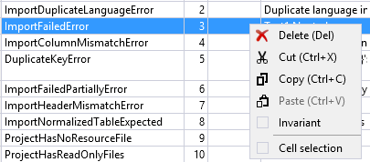

You can copy and paste selected cells or rows or directly export entire resource tables to an Excel file if you prefer editing in another editor 
or want to send it in a generic format to your translator. 

### Copy & paste

There are two modes of copy & paste, depending on the selection mode. The default is full row selection. 
You can change the mode to cell selection in the context menu of the main grid.

#### Full row selection:

Entire rows including a header column with the key and a header row with the language are copied: 

| Key  | Comment   |           | Comment.de | .de      |
|------|-----------|-----------|------------|----------|
| Key1 |           | Neutral 1 |            | German 1 |
| Key2 |           | Neutral 2 |            | German 2 |
| Key3 | a comment | Neutral 3 |            | German 2 |

When pasting in this mode, the same format is expected.
You can remove full rows or entire columns, except for the first row or column.

This mode is useful to move entire rows from one file to another or to exchange content with translators.
The format is robust against modifications, since it maps keys and languages and not just row or column indexes.
When pasting, non-existing keys will be created, existing keys will be overwritten with the clipboard data.

Cut and paste in this mode are only available if you have selected a single resource in the left hand list box - 
otherwise it would be ambiguous in which file to add or replace the items.

#### Cell selection:

When cell selection is active, copy and paste works similar to Excel. You can select any continuous block, 
even across multiple files or projects, and copy or paste it. 
There is no plausibility check in this mode - data is overwritten by position as selected.

Delete, Cut and Invariant are not available in this mode, since they only apply to full rows.

### Excel export and import

To exchange multiple projects or the whole solution you can use Excel export and import.
The format is similar to copy/paste in full row selection; there are two more columns, project and file, 
so this format works across multiple files or projects.

