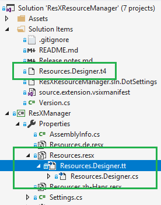

- This option is only available in the Visual Studio Extension
- This option is currently only supported for C# projects

---

The default code generator provided by Visual Studio is not flexible at all - you have to live with the code it generates. 
The only option it provides is to switch between private an public visibility of the generated code.

With ResXManager you get another option: A fully customizable text template based code generator.

### Selecting the code generator


Select one or more resources, right click to open the context menu, and open the `Code generator` sub menu.
Here you can switch between the build in custom tools and the text template provided by ResXManager. 
The small `TT` icon will show you that you have selected the text template based code generator.

#### What gets changed when you select the text template code generator.



- If not already present, the `Resources.Designer.t4` text template file is added to your solution. 
  This file contains the code for the code generator and is shared among all projects to have a single point of maintenence.
  If the file is already present, it won't be overwritten to preserve your changes.
- The built-in code generator is removed from the neutral resources.
- The text template file `Resources.Designer.tt` is added as a nested item to your neutral resources.
- ResXResource manager will trigger the conversion of the text template every time you change any of the resources, 
  to make sure your designer code is always up to date.

---

The `Resources.Designer.tt` file added to every neutral resource just has an include directive to include 
the shared `Resources.Designer.t4`; usually you wont't make any changes to this file:
```xml
<#@ template debug="false" hostspecific="true" language="C#" #>
<#@ include file="$(SolutionDir)Resources.Designer.t4" #>
```

---

The [Resources.Designer.t4](https://raw.githubusercontent.com/tom-englert/ResXResourceManager/master/ResXManager.VSIX/Resources/Resources.Designer.t4) file
contains the logic to read the resource keys and translate them into the designer code. The output is close to 
what the built-in designer generates, plus some useful extras. But since now you have the source code of the 
designer under your control, you can add any modifications you like, or remove extra stuff that you don't need.
