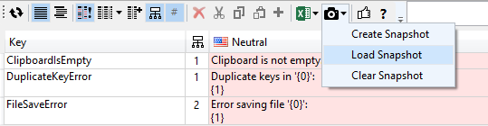
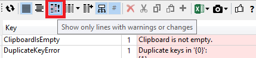

## Snapshots

Snapshots can help you tracking changes.

**Quickly find or export all items that have been changed since the last translation cycle**

* After a translation cycle is complete generate a snapshot. 
* When the next translation cycle starts, load this snapshot to see all entries that have changed highlighted.
* Use the "Warnings and Changes" filter to show only the items that need translation:
        
* Select all and export the selection to send the changes to an external translator.
* Generate another snapshot for the exported state.

**Import only changes compared to the last snapshot**
* Load the snapshot that was generated right after the export
* Import now will only import items that have been changed compared to the loaded snapshot. Items that have been changed between export and import but were not touched by the external translator will be preserved this way.

