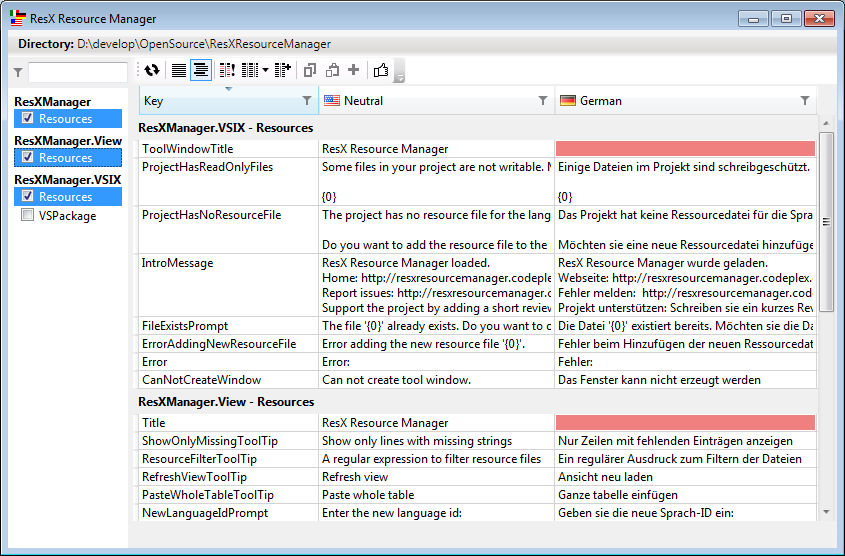
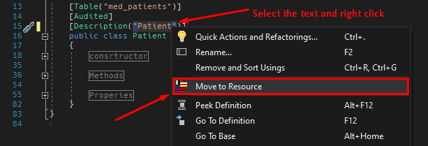

### Visual Studio Extension
ResX Resource Manager Extension can be found in the Tools and in the View|Other Windows menus of Visual Studio. 
The window will show all ResX based resources in the active solution. 
Navigating to a resource in the Solution Explorer will automatically select the resource in the ResX Resource Manager. 
If you are using an integrated SCM, files will be checked out as you type.

### Standalone
Start the ResX Resource Manager and select a directory (usually the solutions directory) in the applications main menu. 
The window will show all ResX based resources in the directory and all sub directories. 
It will simply group the resources by the nearest project file in the directory tree; 
no solution will be parsed, so if you don't have a clean directory, orphan or stale copies of resource or project files will appear in the list as well.

### Move to Resource
You can easily add strings into the resources simply just by selecting the required string including quotes and clicking right mouse button. You will find a context menu item "Move to Resources".

### All versions
When you select a resource file, all entries and their translations will be displayed in an editable grid. 
The first column displays the resource key, the second column the neutral resource, continued by one column per localized language. 
You can add new languages and easily add translations by simply typing the localized string in the new columns that appear in the ResX Resource Manager. 
All entries will be created as you type.

Empty, untranslated entries are marked red, so they are easy to find; you can also sort the columns by clicking the header of any column to move all empty entries to the top. 
This project has integrated the [Data Grid Extensions](https://github.com/tom-englert/DataGridExtensions), so you can simply filter columns to search the view for something special to translate or verify.

### Features
- [Automatic Translations](Automatic-Translations.md)
- [Configure Visible Columns](Configure-Visible-Columns.md)
- [Copy, Paste, Export and Import](Copy,-Paste,-Export-and-Import.md)
- [Custom Code Generator](Custom-Code-Generator.md)
- [Detect Code References](Detect-Code-References.md)
- [Invariant Strings](Invariant-Strings.md)
- [Scripting](Scripting.md)
- [Snapshots](Snapshots.md)
- [Spell Checker](Spell-Checker.md)

**Note**: With the default settings this tool instantly saves the changes as soon as you leave a cell in the data grid. 
There is no save button, and undo is limited to the local undo of the grid's cell. 
If you are using Source Control Management, this is no limitation, since you will anyhow verify the changes before checking in. 
If you don't use an SCM, I would strongly recommend starting to use one ;-)
You can change this behavior in the options page.
 

