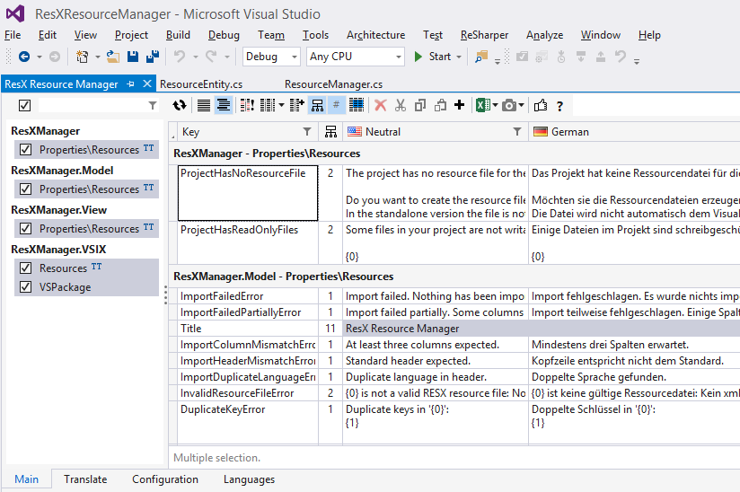
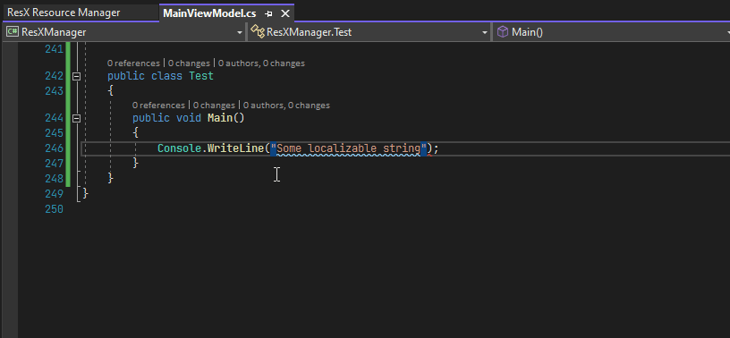
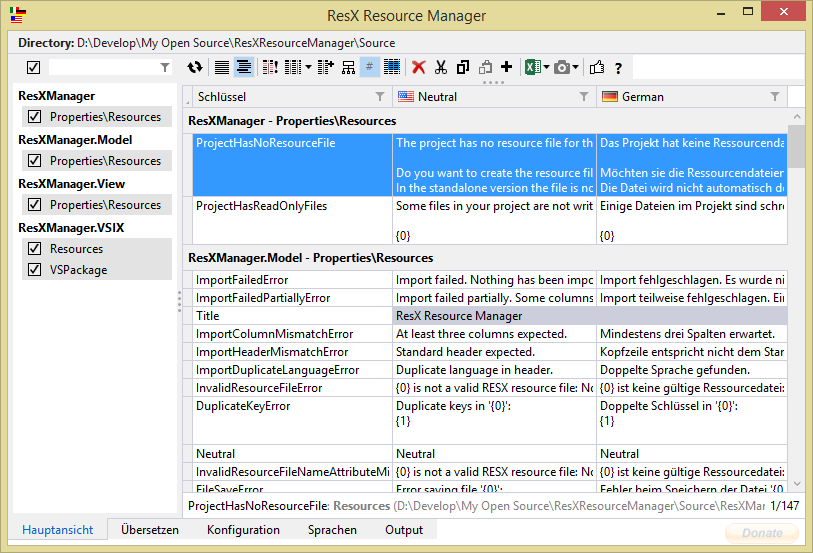

# ResX Resource Manager 

The most popular tool to manage localization of all kind of applications with resx-based resources; one of the highest rated extensions on the [Visual Studio Marketplace](https://marketplace.visualstudio.com/items?itemName=TomEnglert.ResXManager).

---

This is a community driven Open Source project. 
As such it needs your support to keep it alive and evolving. 
The best way to contribute is to help [fixing bugs, or adding new features](https://github.com/tom-englert/ResXResourceManager/issues).
However, if you cannot help with coding, consider to [donate a small amount](Documentation/Topics/Donate.md) to ensure ResX&nbsp;Resource&nbsp;Manager will continue to be a great project that can help you in your daily work.

---

This tool provides central access to all ResX-based string resources in your solution. You can quickly navigate through all resource files and view the content in a well-arranged data grid.
All available languages are displayed side by side in columns, to make it easy to find untranslated strings or clean up orphaned entries. All strings can be quickly edited in place, untranslated entries will be created on the fly while typing.

Suitable for any .Net application; WPF is supported out of the box, just use the x:Static markup extension to access the ResX - resources.

Web applications using Typescript (e.g. Angular) are also supported, see [L10N-Web-Demo](https://github.com/tom-englert/L10N-Web-Demo)

Xamarin apps can be supported using e.g. [XamarinLocalizationSync](https://github.com/maruhe/XamarinLocalizationSync)

## Code of Conduct
This project has adopted the code of conduct defined by the Contributor Covenant to clarify expected behavior in our community.
For more information see the [.NET Foundation Code of Conduct](https://dotnetfoundation.org/code-of-conduct).

## .NET Foundation
This project is supported by the [.NET Foundation](https://dotnetfoundation.org).

## Documentation
Can be found in the [Documentation folder](Documentation/Readme.md).

## Installation
ResXResourceManager is available as VS2019-2022 extension and as a standalone executable to support VS2017 and older or users without Visual Studio at all.
A scripting module is available as well, so you can easily automate resource tasks, e.g. export untranslated string during build.

All versions can be downloaded from the [releases](../../releases) page.

The Visual Studio Extension is also available at the [Visual Studio Marketplace](https://marketplace.visualstudio.com/items?itemName=TomEnglert.ResXManager), or by searching for RESX in the Visual Studio extension manager.
The latest build of the Visual Studio Extension is available at the [Open VsixGallery](http://vsixgallery.com/extension/43b35fe0-1f30-48de-887a-68256474202a)

The standalone version can be installed as click-once application [here](https://clickonce-tom-englert.azurewebsites.net/ResXResourceManager/ResXManager.application).

### Visual Studio Extension:

### Standalone Application:

### Support this Project: 

### Powered by 

### Contributors

This project exists thanks to all the people who contribute. 

### Backers

Thank you to all our backers! 🙏 [[Become a backer](https://opencollective.com/ResXResourceManager#backer)]

### Sponsors

Support this project by becoming a sponsor. Your logo will show up here with a link to your website. [[Become a sponsor](https://opencollective.com/ResXResourceManager#sponsor)]

